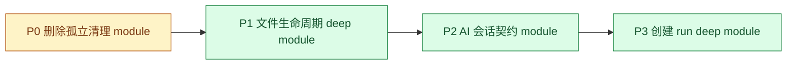

# 架构收敛优先级

> 状态：P0 至 P3 已完成。
> 来源：2026-08-03 全项目架构审查。本文只收敛审查报告中标记为 `Strong` 的四项；`Worth exploring` 项不进入当前序列。

## 目标

以最少的并发架构改动，建立高风险流程的测试面，并把复杂度收回到深 module 的 implementation 中。每一项完成后才进入下一项；不在现有 implementation 之外预建 hypothetical seam。

## 顺序

| 优先级 | 项目 | 理由 | 依赖 |
| --- | --- | --- | --- |
| P0 | 删除孤立元数据清理 module | deletion test 已通过源码调用面：当前实现没有 leverage，先移除可减少后续理解噪音。 | 无 |
| P1 | 文件生命周期 deep module | 文件内容、SQLite 元数据、权限继承、失败清理目前跨多处泄漏，且没有 Python 自动化测试；这是最高的数据完整性风险。 | P0 |
| P2 | AI 会话契约 module | 运行时与浏览器重复拥有协议知识，`repair` run 已与计划文档漂移；先固定 seam 才能安全收敛创建流程。 | P1 |
| P3 | 创建 run deep module | 当前 eight-callback interface 把阶段与修复规则泄漏到多个调用方；它依赖 P2 的稳定有序事件。 | P2 |

P1 与 P2 在实现上没有代码依赖，但本计划仍串行执行：P1 先建立服务端测试惯例并完成高风险数据写入收敛；随后以相同验证标准完成跨进程契约。若团队具备独立验证资源，两项可并行，但不得让 P3 早于 P2。

## P0：删除孤立元数据清理 module

**涉及文件**

- `server/metadata_cleanup_manager.py`
- `server/sqlite_metadata_manager.py`

**收敛内容**

删除未接入的清理 implementation，以及 `SQLiteMetadataManager` 中只用于转发的清理方法。它没有已接入的 route、启动钩子或业务调用；删除后复杂度不会在调用方重现。

**实施约束**

- 删除前用全仓搜索确认没有运行时导入或启动调用。
- 不为未接入功能创建 adapter、seam 或测试 fake。
- 若发现仓库外调用，停止删除，改为单一维护 module，并重新评估优先级。

**完成标准**

1. 目标文件与转发方法删除，所有 import 清理。
2. 服务端启动和文件工作区现有核心流程可运行。
3. 不保留“将来可能使用”的清理 interface。

## P1：文件生命周期 deep module

**涉及文件**

- `server/file_handlers.py`
- `server/routes.py`
- `server/sqlite_metadata_manager.py`
- `server/cobalt_service.py`（仅接入统一写入路径，不在本阶段重塑 Cobalt provider）

**收敛内容**

一个文件生命周期 module 拥有内容写入、元数据落库、权限继承、移动、删除和失败清理。上传、分片、URL 与媒体导入不再各自决定 SQLite 元数据和旁车文件的时机。

`UploadFile`、分片临时文件、URL 和 Cobalt 已是多个真实输入 adapter；本地 filesystem 与 SQLite 仍是当前 implementation 的组成部分，不为未来持久化预建 repository seam。

**实施顺序**

1. 先建立 `server/tests` 的临时 filesystem + SQLite 测试面。
2. 固化当前文件写入的可观察结果：内容、SQLite 元数据、权限继承、失败后无半成品。
3. 把普通上传、分片完成、URL 导入和媒体导入逐步迁入同一 module。
4. 迁移并验证现有旁车元数据后，删除旧 `.meta` 分支和重复路由写入。

**完成标准**

1. 每种导入方式通过同一 interface 落库。
2. 文件内容与 SQLite 元数据在成功和失败路径保持一致。
3. 权限继承和锁定规则不再由各 handler 解释。
4. 针对成功、失败、重试和目录继承的测试可在不启动 HTTP route 的情况下运行。

## P2：AI 会话契约 module

**涉及文件**

- `agent-runtime/src/routes.ts`
- `agent-runtime/src/sse.ts`
- `agent-runtime/src/pi-conversation-module.ts`
- `client/src/lib/aiClient.ts`
- `docs/code-run-self-healing-refactor-plan.md`

**收敛内容**

AI 会话的请求、失败、SSE 事件和终态规则应只有一个契约来源。Fastify/SSE 与浏览器 Fetch/SSE 是两个真实 adapter；它们必须消费同一消息与终态定义，而不是各自手写解析和映射。

`PiConversationModule` 的生命周期 interface 已具备 depth，不拆成 SessionStore 等浅 module。本阶段只修正其实际 TTL 语义，并收紧内部 Pi adapter，使 SDK 事件形状不向会话 module 泄漏。

**实施顺序**

1. 固化事件、失败和终态的共享 fixture；覆盖 `thinking`、`delta`、`completed`、`aborted`、`failed`。
2. 对齐实现与 `code-run-self-healing-refactor-plan.md`：明确 `repair` 的归属，或删去计划中的错误承诺。
3. 让浏览器和运行时从同一契约消费 `conversationId`、`runId` 和终态。
4. 修正会话 TTL：闲置会话必须按期释放，而不是仅在下一次 `create()` 时顺带清理。
5. 明确 AI Runtime Ingress seam 的认证、请求 ID、SSE 不缓冲和取消策略，并给 Vite 与 Nginx 两个 adapter 加最小黑盒检查。

**完成标准**

1. 每个 run 恰有一个终态，迟到事件按 `runId` 丢弃。
2. 浏览器与运行时的契约测试共享 fixture，而非只覆盖 happy path。
3. `repair` 行为与文档、route implementation 一致。
4. TTL 到期后 session 的 `abort` 与 `dispose` 各执行一次；活跃 run 不被回收。
5. 两个 Runtime Ingress adapter 对路径、SSE 和取消呈现相同行为。

## P3：创建 run deep module

**涉及文件**

- `client/src/lib/code-run/CodeRunModule.ts`
- `client/src/lib/agents/ConversationManager.ts`
- `client/src/hooks/useConversationFlow.ts`
- `client/src/components/createpage/ChatInterface.tsx`
- `client/src/contexts/CreatePageContext.tsx`
- `client/src/hooks/useCodeRenderer.ts`

**收敛内容**

加深现有 `CodeRunModule`：生成、校验、最多两次修复、取消和代码积累留在 implementation。调用方只消费 P2 定义的有序事件；`ConversationManager` 只作为 UI projection adapter，`ChatInterface` 不再理解修复次数或流式阶段的内部顺序。

`RenderAdapter` 保留为真实 seam：浏览器 implementation 与内存测试 adapter 构成两种 adapter。不要因“将来 provider”再创建额外的泛化 adapter。

**实施顺序**

1. 以 P2 的事件 fixture 和内存 Render adapter 建立状态机测试。
2. 将 eight-callback interface 收敛为单一有序事件消费路径。
3. 迁移 `ConversationManager`、flow、Context 和聊天渲染到 UI projection。
4. 删除重复的阶段清理、代码累计和重试逻辑。
5. 用浏览器验证思考、代码、校验、两次修复、耗尽和取消。

**完成标准**

1. 修复次数与取消决策只在一个 module 中存在。
2. UI 投影不需要知道内部重试顺序。
3. 首轮、自动修复和继续对话共享同一会话语义。
4. 状态机测试覆盖成功、两次失败、基础设施失败、取消和迟到事件。

## 本轮不纳入

以下项保留在后续审查，不与当前 `Strong` 序列并行：

- 文件工作区命令与实时事件收拢（`Worth exploring`）。
- URL 下载 module 的全局生命周期收敛（`Worth exploring`）。
- Cobalt provider 协议收拢（依赖 P1 后再评估）。
- 编译缓存统计的封装泄漏（低优先级）。
- 旧 CreatePage 状态分支删除（可作为 P3 的收尾清理，不能单独深化）。

## 变更控制

- 每个优先级项单独提交、单独验证；不把下一项的结构变更混入当前项。
- 每项开始前重新运行其相关测试；完成后运行受影响 package 的类型检查、测试和构建。
- 新 module 的 interface 是唯一测试面。若一个 adapter 只有单一 implementation 且没有真实变体，不为可测性强行增加 seam。
- 本文不是 ADR；当认证策略、会话持久化或文件元数据迁移出现不可逆选择时，再新增 ADR。
