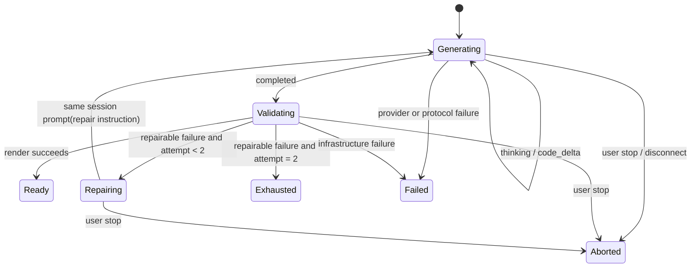

# 同会话代码生成与自愈重构方案

> 状态：核心重构已实施。本文以已安装的 `@earendil-works/pi-coding-agent` / `@earendil-works/pi-ai` `0.83.0` 为基线，配套 SDK 证据见 [Pi SDK 调研记录](./pi-coding-agent-sdk-research.md)。跨进程会话恢复不在当前实现范围内。

## 目标

把当前“浏览器回放历史 + 每个 HTTP 请求临时创建 Pi session”的流程，重构为一个可持续多轮的代码运行流程。

完成后必须满足：

1. 一次生成、自动修复和用户随后发送的“请修复”都在同一个真实 `AgentSession` 中执行。
2. 代码生成结束后，由浏览器预览校验结果决定是否自动修复；可修复的渲染失败最多额外调用模型两次。
3. 用户点击停止会中止当前 Pi run 与上游 Provider 请求，且不会在停止后继续自动修复。
4. 思考、生成、预览校验和“自动修复 1/2”是稳定的聊天状态；思考期间不出现代码悬浮框。
5. 模型选择继续只依赖上游 `GET /v1/models`，不会引入第二个模型目录或把密钥暴露给浏览器。

不在本次范围内：跨进程恢复会话、Pi 编码工具、把浏览器代码交给运行时文件系统执行、改变 Provider 的 OpenAI-compatible 协议。

## 设计决定

### 1. 用深 Module 收拢一次代码运行

新增前端 `CodeRunModule`。它的 Interface 只接受用户意图和取消信号，输出一个有序事件流；调用方不需要理解 Pi 会话、SSE、代码积累、渲染分类、两次上限或迟到事件。

```ts
type CodeRunEvent =
  | { type: 'thinking'; runId: string; text: string }
  | { type: 'code_delta'; runId: string; text: string }
  | { type: 'rendering'; runId: string }
  | { type: 'repairing'; runId: string; attempt: 1 | 2 }
  | { type: 'ready'; runId: string; code: string }
  | { type: 'exhausted'; runId: string; code: string; failure: RenderFailure }
  | { type: 'aborted'; runId: string }
  | { type: 'failed'; runId: string; failure: RunFailure };

interface CodeRunModule {
  execute(input: CodeRunInput, signal: AbortSignal): AsyncIterable<CodeRunEvent>;
}
```

这是本次唯一拥有“是否修复、修复几次”的 Module。`ChatInterface` 只渲染状态并发出用户命令，`useCodeRenderer` 只给出渲染结果，路由只传输事件。这样既有 Depth，也让每个职责保持 Locality。

### 2. 保留两个明确的 Adapter

`CodeRunModule` 依赖两个小的 Adapter，二者都是会真实变化的连接点：

| Adapter | Interface | 责任 |
| --- | --- | --- |
| `PiConversationAdapter` | `create/open/run/abort/release` | 管理同一 `conversationId` 对应的 Pi `AgentSession`，转译 Pi 事件为领域事件。 |
| `RenderAdapter` | `validate(code, language, signal): Promise<RenderOutcome>` | 调用既有 HTML/TSX 预览能力并返回结构化结果，不吞错，也不直接决定重试。 |

不要把恢复逻辑放进 Pi Extension。Extension 不知道浏览器 iframe 是否成功；此处没有需要替换的第三个实现，额外 Extension 只会增加一个浅的 Interface。

```ts
type RenderFailureKind = 'source' | 'dependency' | 'runtime' | 'infrastructure';
type RenderFailure = { kind: RenderFailureKind; message: string; diagnostic?: string };
type RenderOutcome = { ok: true } | { ok: false; failure: RenderFailure };
```

`source`、`dependency`、`runtime` 才消耗自动修复次数。编译服务不可用、网络错误、鉴权失败、用户取消属于 `infrastructure` / `aborted`，不向模型发送无意义的修复消息。

### 3. 后端持有真实 Pi 会话

替换 `GenerationRuntime.generate()` 的“创建、种子化历史、结束即 dispose”实现，新增后端 `PiConversationModule`：

```ts
interface PiConversationModule {
  create(input: NewConversation): Promise<{ conversationId: string; model: string }>;
  run(input: ConversationRun, signal: AbortSignal): AsyncIterable<PiConversationEvent>;
  abort(conversationId: string, runId: string): Promise<void>;
  release(conversationId: string): Promise<void>;
}
```

- `conversationId` 为服务端生成的不透明 ID，不能是 Pi session 文件名。
- 新会话固定创建时所选模型。自动修复和手动继续对话必须复用该模型，防止一次 run 中途模型选择变化。
- 一个会话一次只运行一个 `prompt()`；新的用户运行必须等上一个完成或先取消，避免 Pi 队列让 UI 状态失真。
- 第一阶段以进程内会话表和闲置 TTL 保存 `AgentSession`，TTL 到期后 `abort()`、`dispose()` 并删除表项。没有跨进程会话恢复需求前，不写入用户代码/提示词 JSONL。
- 后续若必须跨重启恢复，仅替换该 Module 内部为 `SessionManager.create/open`；外部 Interface 与浏览器协议不变。

Pi `0.83.0` 的 `AgentSession` 保留完整的结构化消息（包括 Provider 必需的 thinking signature），因此绝不再把前端截断文本重新 seed 成新 session。每次会话运行使用 `session.prompt()`；`steer()` 与 `followUp()` 只适合模型尚在运行时的队列行为，不适用于等待浏览器渲染结果后的修复。

## HTTP 与事件协议

保留 `GET /api/ai/models` 和它对上游 `/v1/models` 的唯一所有权。新增会话化端点，完成迁移后移除旧 `POST /api/ai/generate`：

```text
POST   /api/ai/conversations
POST   /api/ai/conversations/:conversationId/runs
DELETE /api/ai/conversations/:conversationId/runs/:runId
```

创建请求包含 `model` 和首轮所需的系统/用户意图；run 请求只包含 `kind: 'initial' | 'user'` 与文本。自动修复由 `CodeRunModule` 组装为内部 `user` 消息，服务端不区分第三种 `repair` run；它仍会校验会话存在和用户消息内容。

SSE 的每条事件都带 `conversationId` 与 `runId`。事件序列为：任意 `thinking` / `delta` -> `completed`，或 `aborted` / `failed`。浏览器按 `runId` 丢弃迟到事件。用户停止通过 `DELETE` 明确抵达服务器；SSE close 仍作为兜底取消链路。

## 自愈状态机



自动修复 prompt 由 `CodeRunModule` 组装，包含语言、上一次完整代码与裁剪后的结构化诊断，并要求输出完整可替换代码。它在 Pi session 中是内部消息，但聊天区只显示“正在自动修复 1/2”，不伪造用户聊天记录。第二次修复后仍失败，保留最终代码和错误，允许用户正常继续对话修复。

Pi 的 `auto_retry_*` 是 Provider/agent 层的传输重试，仅透传为可观测事件；它不计入两次业务级渲染修复，也不会触发浏览器 `RenderAdapter`。

## 修改清单

| 位置 | 修改 |
| --- | --- |
| `agent-runtime/package.json`、`package-lock.json` | 保持 `pi-coding-agent`、`pi-ai` 严格同步在 `0.83.0`。 |
| `agent-runtime/src/pi-provider.ts` | 使用 `ModelRuntime.create()`、`InMemoryCredentialStore`、`setRuntimeApiKey()` 和内存 `SettingsManager`；不使用已移除的 `AuthStorage` / `ModelRegistry` 构造方式。 |
| `agent-runtime/src/pi-conversation-module.ts`（新增） | 会话表、串行租约、TTL、真实 `AgentSession` 生命周期、Pi 事件转译与取消。 |
| `agent-runtime/src/routes.ts` | 添加会话化 HTTP/SSE/cancel Interface，逐步下线旧单请求路由。 |
| `client/src/lib/code-run/CodeRunModule.ts`（新增） | 编排初始生成、渲染校验和最多两次修复。 |
| `client/src/lib/code-run/PiConversationAdapter.ts`（新增） | 封装会话端点与 SSE 解析。 |
| `client/src/hooks/useCodeRenderer.ts` | 把当前 catch 内吞错和 DOM 副作用拆出，暴露 `RenderOutcome`；显示错误由调用方根据结果处理。 |
| `client/src/lib/agents/CodeGenerator.ts`、`ConversationManager.ts` | 移除浏览器端历史回放与重试决策，迁移为 `CodeRunModule` 的薄适配或删除。 |
| `client/src/hooks/useConversationFlow.ts`、`ChatInterface.tsx`、CreatePage 状态 | 只消费统一 run 事件，加入稳定的 `validating` / `repairing` 状态与停止命令。 |
| `nginx.conf` | 保持 `/api/ai/` 的 SSE 缓冲关闭、足够的读取超时和心跳兼容设置。 |

## 实施顺序

1. 固化 Pi `0.83.0` 适配与现有模型目录测试，确保 `/v1/models` 仍是唯一模型来源。
2. 以 fake Pi Adapter 编写 `PiConversationModule` 的会话串行、取消、TTL 和迟到事件测试，再接入真实 Pi `AgentSession`。
3. 将 `useCodeRenderer` 改为可返回 `RenderOutcome` 的 Adapter，同时保留当前预览视觉行为。
4. 以 fake Pi/Render Adapter 为 `CodeRunModule` 写状态机测试，再替换 `ConversationManager` 的生成路径。
5. 接入新端点与取消按钮，灰度使用会话化路径；确认后删除历史回放和旧路由。
6. 最后清理调试日志、重复的 retry UI、无效状态和不再引用的 `CodeGenerator` 代码。

## 验证方式

### 自动化

1. `npm --prefix agent-runtime run type-check`
2. `npm --prefix agent-runtime test`
3. `npm --prefix agent-runtime run build`
4. `npm --prefix client run build`
5. 目录契约测试：上游 `/v1/models` 的鉴权、排序、默认模型缺失、过期目录回退。
6. 后端会话测试：同 `conversationId` 连续 run 只创建一个 Pi session；不同会话互不串扰；TTL 后释放；`abort()` 只调用一次。
7. `CodeRunModule` 测试：首次失败后第一次修复成功；连续失败时初始生成加两次修复后 `exhausted`；基础设施失败零次修复；任意阶段取消后无下一次 prompt；迟到事件被丢弃。
8. SSE 契约测试：thinking、code delta、completed、aborted、failed 均带 `runId`，且每个 run 恰好一个终态。

### 浏览器验收

1. 思考时只显示思考内容，不显示代码面板或“正在生成代码”。
2. 代码开始流式输出后才显示代码面板；预览成功后显示新页面。
3. 让一次生成产生已知 TSX/HTML 错误，确认显示“正在自动修复 1/2”，并在成功后恢复预览。
4. 让三次结果都不可渲染，确认恰好两次自动修复后停止，最终错误和代码均保留。
5. 在生成、预览、自动修复三个阶段分别点击停止，确认无后续模型请求，随后仍能手动继续该会话。
6. 在一次渲染失败后输入“修复这个错误”，确认生成上下文沿用同一 Pi session，而不是把聊天历史重新拼接为请求。

## 风险与约束

- 内存会话只能在单一 runtime 实例内连续工作。以后横向扩容前，必须先选定粘性路由或持久会话 Adapter，不能让请求随机落到不同进程。
- 会话内容包含用户提示和生成代码。即使目前不落盘，也必须有 TTL、容量上限和不记录正文的结构化日志。
- 一个会话串行化会使用户的并发点击排队或被拒绝，这是刻意选择：它比错配思考/代码事件更可预测。
- `PI_MAX_RETRIES` 仍只控制 Provider 传输重试；`PI_MAX_TOKENS` 已移除，输出长度交由 SDK/Provider 默认值决定。
